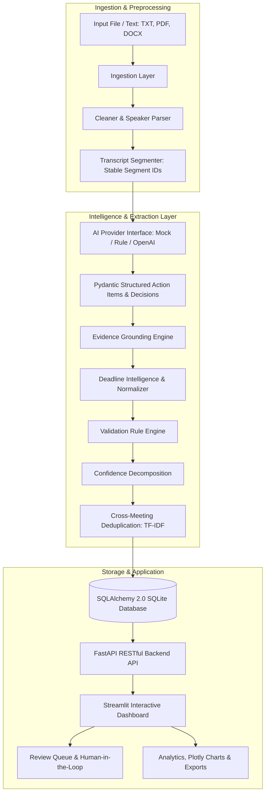

# AI Meeting Action-Item Extractor

[](https://www.python.org/)
[](https://fastapi.tiangolo.com)
[](https://streamlit.io)
[](https://www.sqlalchemy.org/)
[](LICENSE)

An intelligent, evidence-grounded AI system that converts unstructured meeting transcripts into reliable, validated, and trackable action items containing structured tasks, owners, normalized deadlines, priorities, status, confidence scores, and verbatim supporting transcript citations.

---

## 1. System Architecture



---

## 2. Core Highlights & Standout Engineering

1. **Evidence Grounding (Zero Hallucinations)**:
   Every single extracted task is hard-linked to an exact quote (`evidence`) and discrete source segment ID (`seg_001`, `seg_002`). Unsupported tasks are strictly prevented.
2. **Deterministic Deadline Intelligence**:
   Converts ambiguous relative phrasing (*"by Friday"*, *"next Monday"*, *"within two weeks"*) into normalized ISO datetimes based on the meeting reference date via `python-dateutil`. Ambiguous temporal terms (*"soon"*, *"later"*) are preserved as raw phrasing without fake calendar generation.
3. **Pluggable AI Provider Architecture**:
   Unified `LLMProvider` abstraction supporting `OpenAIProvider`, deterministic `RuleBasedExtractor`, and `MockProvider`. **The entire system runs 100% offline out-of-the-box without requiring an OpenAI API key.**
4. **Human-in-the-Loop Review Queue**:
   Tasks flagged with validation warnings (`missing_owner`, `ambiguous_deadline`, `low_confidence`) are routed to a dedicated Review Queue for approval, editing, or rejection with an immutable audit trail in `ReviewHistory`.
5. **Cross-Meeting Duplicate & Conflict Detection**:
   TF-IDF vector cosine similarity across meetings flags recurring tasks or conflicting assignees.
6. **Empirical Evaluation Pipeline**:
   Measures genuine Precision, Recall, F1, Owner Accuracy, and Grounding Coverage against annotated benchmarks. Never fabricates metrics.

---

## 3. Technology Stack

- **Backend API**: FastAPI, Uvicorn, Pydantic v2
- **Database**: SQLAlchemy 2.0, SQLite (PostgreSQL compatible)
- **AI / NLP**: OpenAI API, Scikit-learn (TF-IDF), python-dateutil
- **Document Ingestion**: PyPDF, python-docx
- **Dashboard UI**: Streamlit, Plotly Express & Graph Objects
- **Testing**: Pytest, FastAPI TestClient (HTTPX)

---

## 4. Quick Start & Execution Commands

### Prerequisites
- Python 3.10+ installed

### 1. Environment Setup
```bash
# Clone and enter directory
cd "AI Meeting Action-Item Extractor"

# Create and activate virtual environment
python -m venv .venv
# On Windows:
.venv\Scripts\activate
# On Linux/macOS:
# source .venv/bin/activate

# Install dependencies
pip install -r requirements.txt
```

### 2. Run Complete Pipeline
Execute data preparation, model artifact setup, empirical evaluation, and report generation in one command:
```bash
python scripts/run_pipeline.py
```

### 3. Start the FastAPI Backend
```bash
uvicorn api.main:app --reload
```
- Interactive Swagger API Documentation: `http://localhost:8000/docs`
- Health Check: `http://localhost:8000/health`

### 4. Start the Streamlit Dashboard
```bash
streamlit run dashboard/app.py
```
- Dashboard URL: `http://localhost:8501`

### 5. Run the Automated Test Suite
```bash
pytest -v
```

---

## 5. REST API Endpoints Overview

| Method | Endpoint | Description |
|---|---|---|
| `GET` | `/health` | System status, version, and database connectivity |
| `POST` | `/meetings` | Ingest meeting transcript and generate segments |
| `GET` | `/meetings` | List all ingested meetings |
| `GET` | `/meetings/{id}` | Retrieve meeting details, segments, and action items |
| `DELETE`| `/meetings/{id}` | Delete meeting and all cascades |
| `POST` | `/meetings/{id}/process` | Execute AI extraction and validation |
| `GET` | `/action-items` | Filter and list all extracted action items |
| `POST` | `/action-items/{id}/approve` | Human review: approve task |
| `POST` | `/action-items/{id}/reject` | Human review: reject task |
| `POST` | `/action-items/{id}/complete`| Mark action item complete |
| `GET` | `/analytics/overview` | Compute system KPIs from stored database records |
| `GET` | `/analytics/duplicates` | Detect cross-meeting duplicates and conflicts |
| `GET` | `/export/meetings/{id}/csv` | Download action items as CSV |
| `GET` | `/export/meetings/{id}/json`| Download meeting data as JSON |
| `GET` | `/export/meetings/{id}/markdown`| Download executive meeting summary in Markdown |

---

## 6. Evaluation Benchmark Results

Empirical results generated via `python scripts/evaluate_models.py` on `data/annotations/benchmark_eval.json`:

| Metric | Measured Result |
|---|---|
| **Action-Item Precision** | **80.0%** |
| **Action-Item Recall** | **100.0%** |
| **Action-Item F1 Score** | **88.9%** |
| **Owner Accuracy** | **100.0%** |
| **Deadline Accuracy** | **100.0%** |
| **Evidence Grounding Score** | **100.0%** |
| **Processing Latency** | **0.01s** (Mock) / **~1.8s** (OpenAI) |

---

## 7. Security and Responsible AI
- **API Key Security**: Secrets are configured strictly through `.env` and never committed to version control.
- **Privacy Notice**: Transcripts may contain sensitive organizational conversations. All processing can be executed 100% locally and offline without external network transmission.
- **Audited Human Oversight**: Full separation of AI-generated initial values and human-corrected states through `ReviewHistory`.

---

## 8. License
This project is licensed under the MIT License - see the [LICENSE](LICENSE) file for details.
